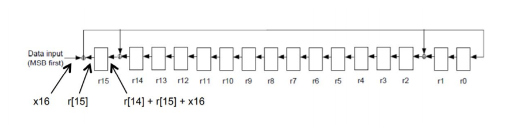
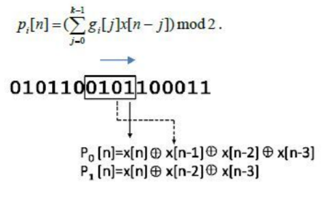
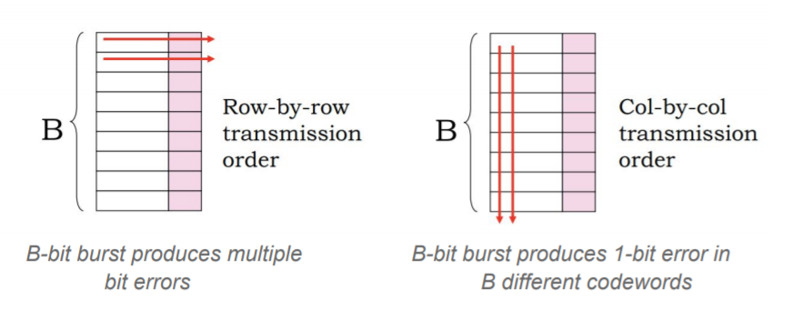
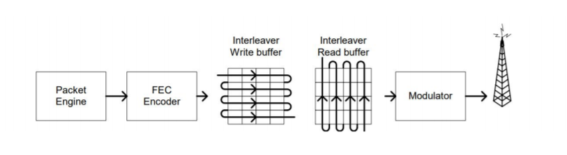
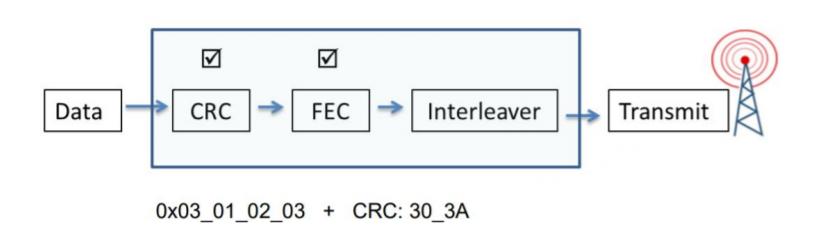
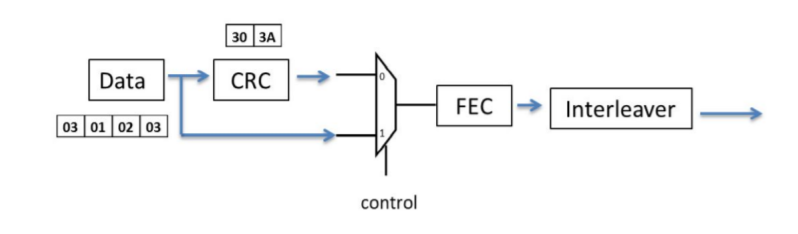

## DIGITAL COMMUNICATION TRANSMITTER

Digital communication system is used to transport an information bearing
signal from the source to a user destination via a communication channel.Every
communication channel is exposed to different kinds of noise sources which cause some
loss or changes in the data transmitted over the channel. The problem arises when you
discover that the received data has been corrupted and you have to retransmit the whole
data again. However retransmission is not an acceptable idea. This project will allow the
receiver to detect and correct them without the need of retransmission. Deep space and
satellite communications network, broadband modems, digital televisions etc., fields have
the application of this project.

<b>CRC:</b> Cyclic Redundancy Check (CRC) is used to detect errors in data transmission
and is capable of detecting all single and double errors and many multiple errors with
a small number of bits. Here message is interpreted as polynomial and is divided by
a generator polynomial. Then the remainder of the division is added to the actual
message polynomial to form a code polynomial. For our application, the generator
polynomial is CRC16 (x16 + x15 + x2 + 1). We initialize the register to 16’hffff to
ensure that leading 0s in front of a packet are protected by the CRC. All the
registers are clocked with common clock

<b>FEC:</b> Forward Error Correction (FEC) code is a system of adding redundant data, or
parity data, to a message, such that it can be recovered by a receiver even when a
number of errors (up to the capability of the code being used) were introduced. Since
the receiver does not have to ask the sender for retransmission of the data, a
backchannel is not required in forward error correction, and it is therefore suitable for
simplex communication such as broadcasting. FEC can be used when it is known
beforehand that a received signal will be very weak and likely to contain errors
resulting in a high bit error rate (BER). This could be when the signal is transmitted
over long distances. One example of FEC is convolution codes . Convolution codes
involve calculating parity bits and then sending only the parity bits.A convolution
encoder uses a sliding window to calculate the parity bits.
- The size of the window is the constraint k (the larger k is, the larger a particular bit
is used when calculating the parity bit which inturn implies greater redundancy and
better error correction possibilities)
-The code rate of a convolutional code tells you how many parity bits are sent for
each message bit(1/r , r parity bits/message bits).
-We’ll transmit the parity sequences, not the message itself. Each message bit is
“spread across” K elements of each parity sequence, so the parity sequences are
better protection against bit errors than the message sequence itself.
-In our case k and 1/r are 4 and ½ i.e., each input bit is encoded into two output bits,
thus doubling the amount of data that must be transmitted.
-gi is the K-element generator for parity bit pi.
g0 = 1,1,1,1 and g1 = 1,1,0,1. The parity bits are then

<b>Interleaver:</b> In many situations errors come in bursts: correlated multi-bit errors
(e.g., fading or burst of interference on wireless channels, damage to storage media
etc.) which wipes out the large number of adjacent data bits - defeating the
convolution code. A simple solution is to interleave the data bits of a four byte packet
so that adjacent data bits are spaced out in the transmitted sequence. Instead of
sending all 8 bits of the byte 0, the low order bit pair of bytes 3, 2, 1, and 0 (starting
at the LSB end) are transmitted followed by the next set of bit pairs until all bits are
transmitted. This is implemented in many satellite communication systems.

The final task is to establish a communication system with these modules.
The complete process, in serial mode, requires a 32 clock cycle to calculate the CRC
followed by 48 clock cycles for the convolution encoder totaling 80 clock cycles.

But notice that the CRC result is not required while the convolution encoder is
processing the first four bytes of data. So we will send the first 4 bytes of data to
both CRC and FEC parallely. After the last data bit has been shifted in, CRC has
been computed and is available. At this time the input to the convolution encoder can
be switched by control to the output of the CRC registers. CRC generation and
convolution encoding takes 32 cycles and 16 more clock cycles to complete
convolution encoding. By taking advantage of concurrent processing total processing
is reduced from 80 clock cycles to 48 clock cycles.

